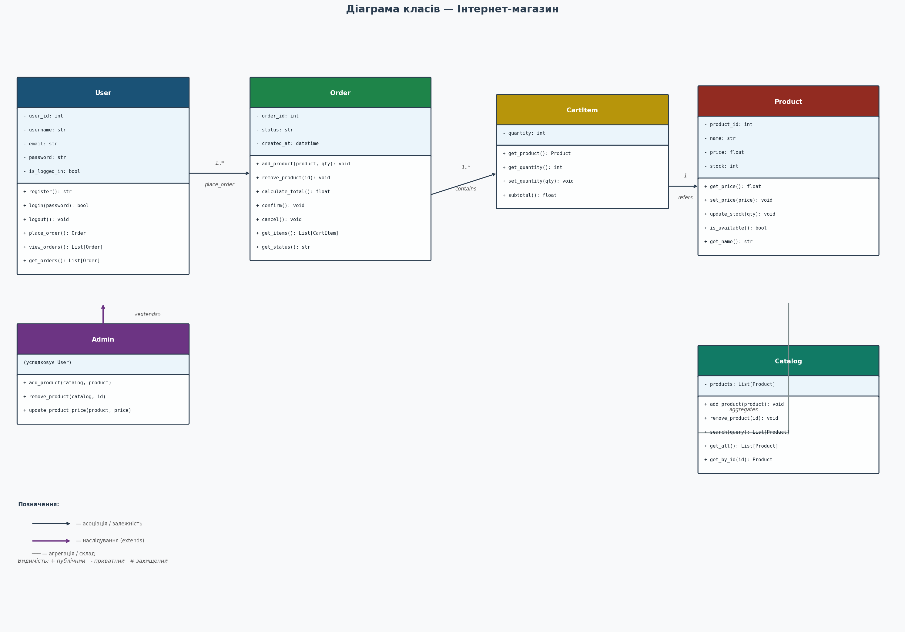
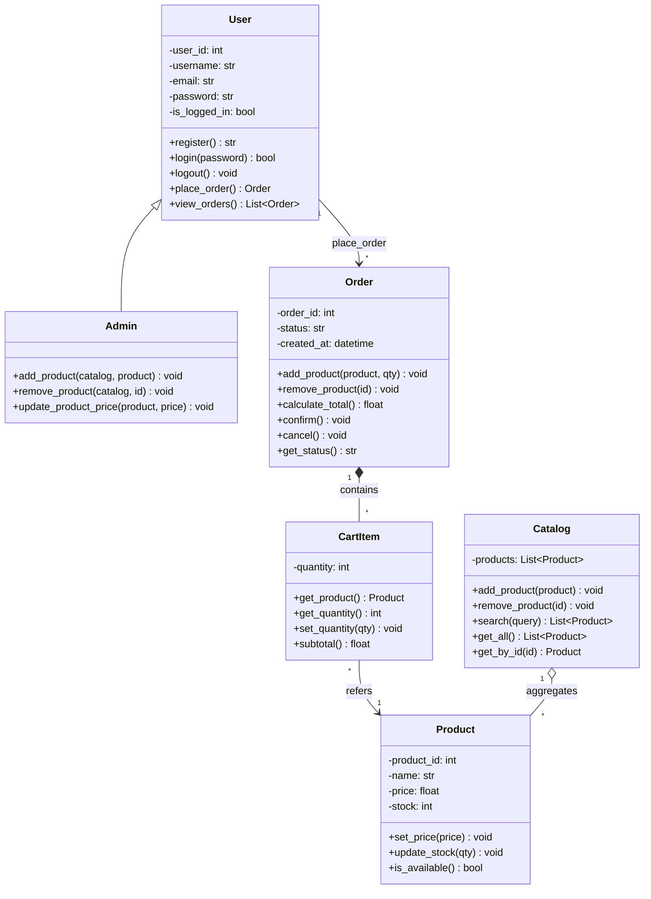
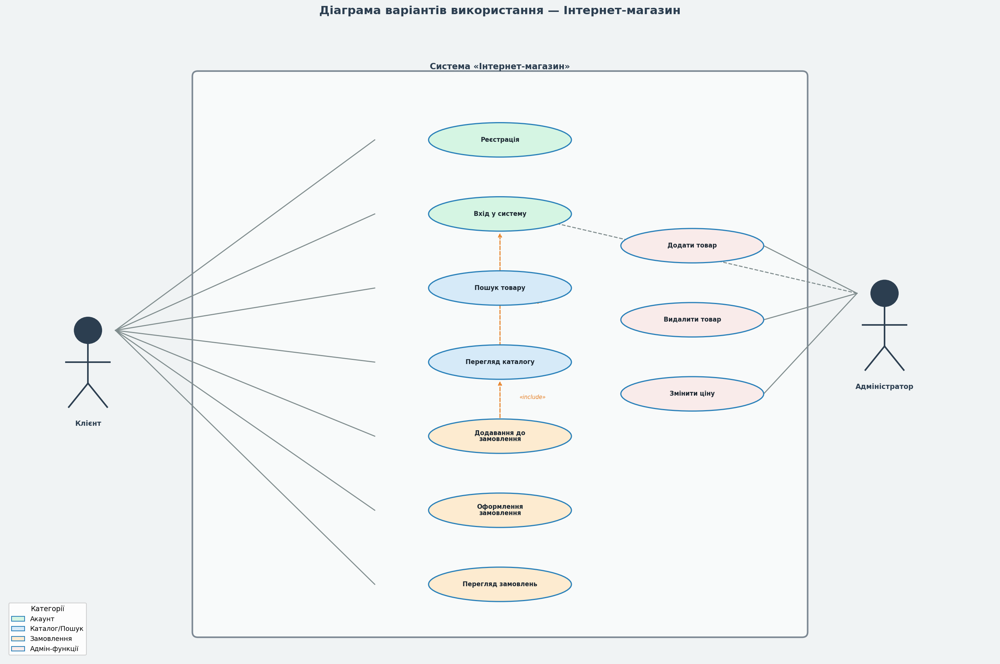
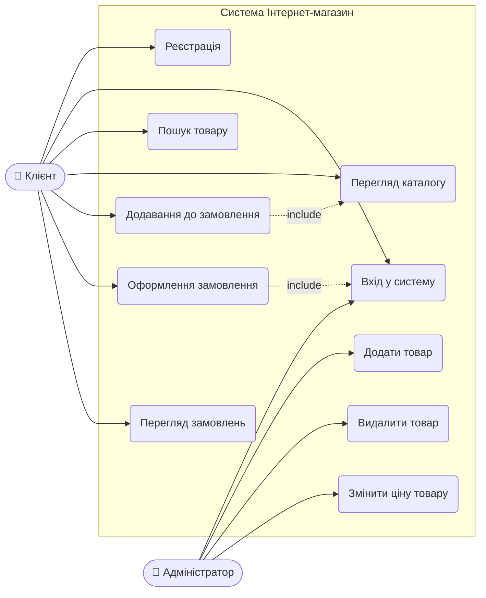

## Лаб 3 — UML-діаграми та реалізація системи "Інтернет-магазин"
 
**Файли:** `shop.py`, `shop_tests.py`

### Крок 1 — UML-діаграми

#### Діаграма класів





#### Діаграма варіантів використання





---

### Крок 2 — Реалізація класів

Реалізовано 5 класів у файлі `shop.py`:

| Клас | Відповідальність |
|---|---|
| `Product` | Товар: ціна, склад, доступність |
| `CartItem` | Позиція у замовленні: товар + кількість |
| `Order` | Замовлення: список товарів, статус, сума |
| `User` | Користувач: реєстрація, вхід, замовлення |
| `Admin` | Адміністратор: управління каталогом (успадковує User) |
| `Catalog` | Каталог товарів: пошук, додавання, видалення |

Всі атрибути приватні (`__`), доступ через getters/setters — відповідно до принципу інкапсуляції.

---

### Крок 3 — Модульні тести

Написано **24 тести** у файлі `shop_tests.py` з використанням `unittest`. Всі пройшли успішно.

| № | Тест | Що перевіряє |
|---|---|---|
| 1 | `test_product_attributes` | Базові атрибути товару |
| 2 | `test_product_is_available` | Товар доступний при stock > 0 |
| 3 | `test_product_not_available_when_no_stock` | Товар недоступний при stock = 0 |
| 4 | `test_set_price` | Зміна ціни |
| 5 | `test_set_negative_price_raises` | Від'ємна ціна — виняток |
| 6 | `test_update_stock` | Списання зі складу |
| 7 | `test_update_stock_below_zero_raises` | Склад нижче 0 — виняток |
| 8 | `test_new_order_status_is_pending` | Початковий статус замовлення |
| 9 | `test_add_product_and_calculate_total` | Додавання товарів і розрахунок суми |
| 10 | `test_remove_product` | Видалення товару із замовлення |
| 11 | `test_confirm_order` | Підтвердження замовлення |
| 12 | `test_confirm_empty_order_raises` | Підтвердження порожнього — виняток |
| 13 | `test_cancel_order` | Скасування замовлення |
| 14 | `test_add_unavailable_product_raises` | Додавання недоступного товару — виняток |
| 15 | `test_register_returns_message` | Реєстрація повертає повідомлення |
| 16 | `test_login_success` | Успішний вхід |
| 17 | `test_login_wrong_password` | Невірний пароль |
| 18 | `test_logout` | Вихід із системи |
| 19 | `test_place_order_without_login_raises` | Замовлення без входу — виняток |
| 20 | `test_order_linked_to_user` | Замовлення прив'язане до користувача |
| 21 | `test_search_by_name` | Пошук товарів за назвою |
| 22 | `test_search_no_results` | Пошук без результатів |
| 23 | `test_get_by_id` | Отримання товару за ID |
| 24 | `test_admin_remove_product` | Адмін видаляє товар з каталогу |

### Запуск тестів

```bash
python shop_tests.py
```

### Файли

- `shop.py` — реалізація класів системи
- `shop_tests.py` — модульні тести (24 тести)
- `uml_class_diagram.png` — діаграма класів (PNG)
- `uml_usecase_diagram.png` — діаграма use case (PNG)
