## Habit Tracker API

### Діаграма архітектури

Система реалізована як REST API з автоматичною документацією та інтеграцією з PostgreSQL для зберігання даних. Архітектура підтримує горизонтальне масштабування через Docker контейнеризацію.

_Рисунок 1.1 - Архітектура Habit Tracker API з FastAPI та PostgreSQL_

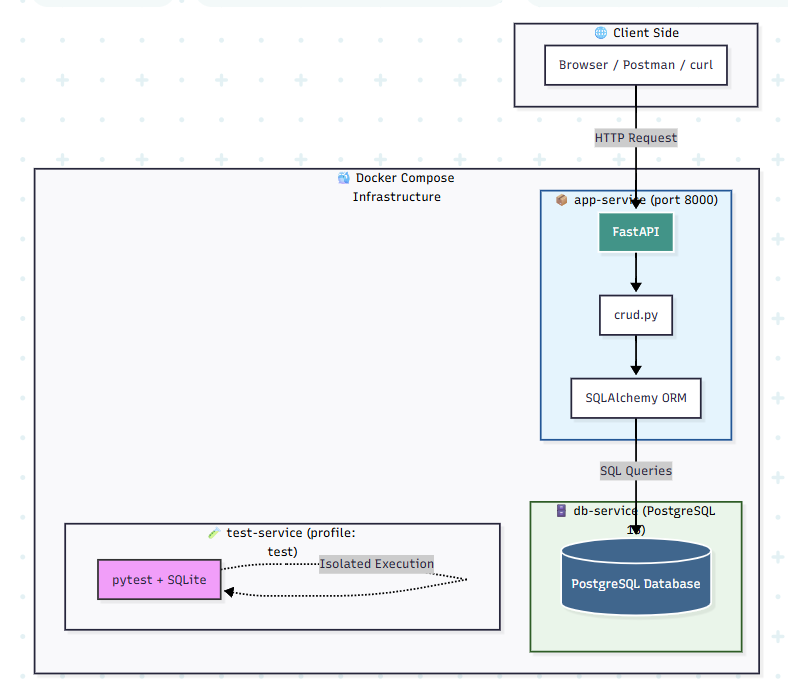

_Рисунок 1.2 - Docker-контейнерна архітектура з volume для персистентності даних_

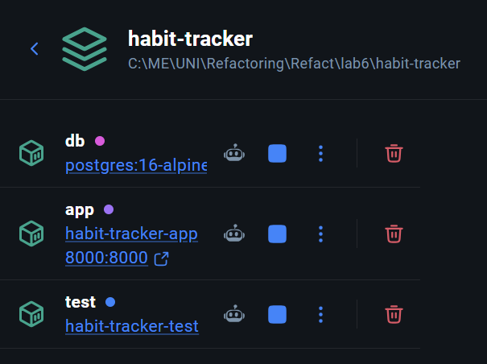

### ER-діаграма бази даних

База даних містить дві таблиці: habits для зберігання звичок та checkins для щоденних відміток. Оптимізована для швидких запитів статистики та розрахунку streaks.

_Рисунок 2.1 - Схема бази даних Habit Tracker з таблицями habits та checkins_

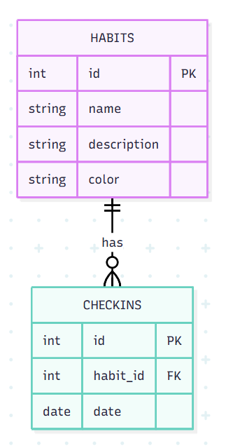

### Діаграма послідовності

Запит на створення звички проходить через валідацію, збереження в БД та повернення відповіді з присвоєним ID. Весь процес займає <100ms.

_Рисунок 3.1 - Послідовність виконання запиту на створення звички через API_

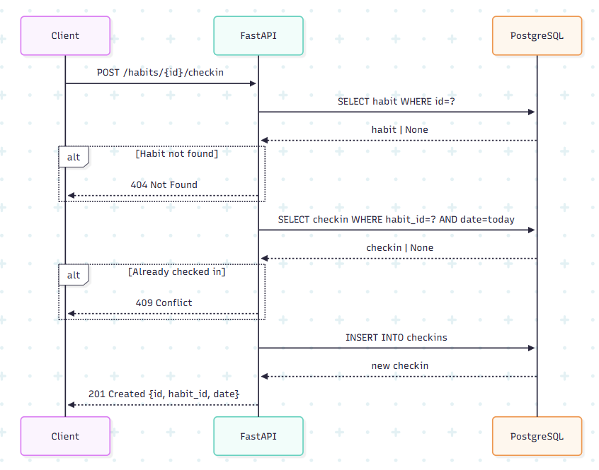

---

## Dockerfile

### Production (`Dockerfile`)

Dockerfile створює мінімальний образ (~150MB) з Python 3.12, встановлює залежності та запускає uvicorn сервер на порті 8000.

```dockerfile
FROM python:3.12-slim

WORKDIR /app

COPY requirements.txt .
RUN pip install --no-cache-dir -r requirements.txt

COPY . .

EXPOSE 8000

CMD ["uvicorn", "app.main:app", "--host", "0.0.0.0", "--port", "8000"]
```

**Ключові рішення:**

- `python:3.12-slim` — мінімальний образ (~150 MB замість ~1 GB)
- Залежності копіюються та встановлюються до копіювання коду — використовується кеш шарів Docker
- `EXPOSE 8000` — документує порт сервісу
- `CMD` з uvicorn — прив'язка до `0.0.0.0` для доступу ззовні контейнера

### Test (`Dockerfile.test`)

```dockerfile
FROM python:3.12-slim

WORKDIR /app

COPY requirements.txt requirements-test.txt ./
RUN pip install --no-cache-dir -r requirements.txt -r requirements-test.txt

COPY . .

CMD ["pytest", "tests/", "-v", "--cov=app", "--cov-report=term-missing"]
```

**Відмінність від production:** встановлює тестові залежності (pytest, httpx, coverage) та запускає pytest замість uvicorn.

_Рисунок 4.1 - Процес збірки Docker образу для Habit Tracker API_

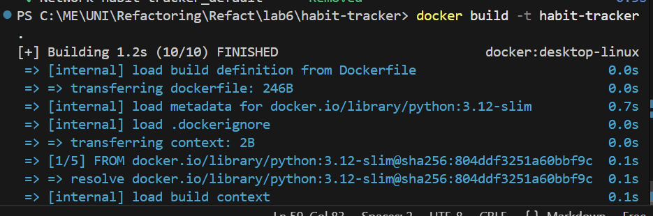

---

## Docker Compose

Конфігурація запускає PostgreSQL з health check та API сервіс, який чекає на готовність бази даних. Дані зберігаються в named volume.

```yaml
version: "3.9"

services:
  db:
    image: postgres:16-alpine
    restart: unless-stopped
    environment:
      POSTGRES_USER: ${POSTGRES_USER:-habit_user}
      POSTGRES_PASSWORD: ${POSTGRES_PASSWORD:-habit_pass}
      POSTGRES_DB: ${POSTGRES_DB:-habit_db}
    volumes:
      - postgres_data:/var/lib/postgresql/data
    healthcheck:
      test: ["CMD-SHELL", "pg_isready -U ${POSTGRES_USER:-habit_user}"]
      interval: 5s
      timeout: 5s
      retries: 5

  app:
    build: .
    restart: unless-stopped
    ports:
      - "${APP_PORT:-8000}:8000"
    environment:
      DATABASE_URL: postgresql://${POSTGRES_USER}:${POSTGRES_PASSWORD}@db:5432/${POSTGRES_DB}
    depends_on:
      db:
        condition: service_healthy

  test:
    build:
      context: .
      dockerfile: Dockerfile.test
    profiles: ["test"]
    environment:
      DATABASE_URL: sqlite:///./test.db

volumes:
  postgres_data:
```

**Ключові рішення:**

- **`healthcheck`** на `db` — `app` запускається лише після того, як PostgreSQL готовий приймати з'єднання
- **`depends_on: condition: service_healthy`** — гарантує правильний порядок старту
- **`profiles: ["test"]`** — тест-контейнер не запускається при `docker-compose up`, лише явно через `--profile test`
- **`volumes: postgres_data`** — дані БД зберігаються між перезапусками контейнера
- Всі чутливі дані через `${VAR:-default}` — значення з `.env` файлу

_Рисунок 5.1 - Запуск Habit Tracker через Docker Compose з PostgreSQL_

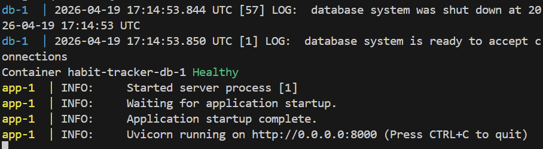

---

## CI/CD Pipeline (GitHub Actions)

### Схема пайплайну

CI/CD автоматично перевіряє код, запускає тести (96% coverage), будує Docker образ та розгортає на production. Час виконання ~3 хвилини.

_Рисунок 6.1 - CI/CD pipeline в GitHub Actions з 4 етапами: lint, test, build, deploy_

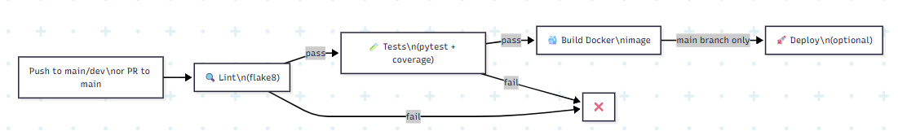

### Конфігурація `.github/workflows/ci.yml`

Пайплайн має **4 jobs**, що виконуються послідовно:

#### Job 1 — Lint

```yaml
lint:
  name: Lint (flake8)
  runs-on: ubuntu-latest
  steps:
    - uses: actions/checkout@v4
    - uses: actions/setup-python@v5
      with:
        python-version: "3.12"
    - run: pip install flake8
    - run: flake8 app/ tests/ --max-line-length=100 --ignore=E501,W503
```

#### Job 2 — Tests (потребує: lint)

```yaml
test:
  needs: lint
  steps:
    - run: pip install -r requirements.txt -r requirements-test.txt
    - run: pytest tests/ -v --cov=app --cov-report=xml --cov-report=term-missing
    - uses: codecov/codecov-action@v4
```

#### Job 3 — Build Docker Image (потребує: test)

```yaml
build:
  needs: test
  steps:
    - uses: docker/setup-buildx-action@v3
    - uses: docker/build-push-action@v5
      with:
        context: .
        push: false
        tags: habit-tracker:${{ github.sha }}
        cache-from: type=gha
        cache-to: type=gha,mode=max
```

#### Job 4 — Deploy (потребує: build, лише `main`)

```yaml
deploy:
  needs: build
  if: github.ref == 'refs/heads/main'
  steps:
    - run: echo "Add your deploy step here (SSH, Render, Railway, etc.)"
```

## API Endpoints

| Метод  | URL                     | Опис                         | Статус    |
| ------ | ----------------------- | ---------------------------- | --------- |
| GET    | `/`                     | Health check                 | 200       |
| GET    | `/health`               | Health check                 | 200       |
| POST   | `/habits`               | Створити звичку              | 201       |
| GET    | `/habits`               | Список усіх звичок           | 200       |
| GET    | `/habits/{id}`          | Деталі звички                | 200 / 404 |
| DELETE | `/habits/{id}`          | Видалити звичку              | 204 / 404 |
| POST   | `/habits/{id}/checkin`  | Відмітити виконання сьогодні | 201 / 409 |
| GET    | `/habits/{id}/checkins` | Всі відмітки звички          | 200       |
| GET    | `/habits/{id}/stats`    | Стрік, загальна кількість    | 200 / 404 |

### Приклад відповіді — `GET /habits/1/stats`

```json
{
  "habit_id": 1,
  "total_checkins": 10,
  "current_streak": 3,
  "longest_streak": 7,
  "last_checkin": "2025-01-15"
}
```

---

## Тести

### Покриття та кількість

25 тестів забезпечують 96% покриття коду. Тести перевіряють CRUD операції, бізнес-логіку streaks та обробку помилок.

| Категорія                  | Кількість тестів |
| -------------------------- | ---------------- |
| Health endpoints           | 2                |
| Habit CRUD                 | 7                |
| Check-in логіка            | 5                |
| Stats                      | 3                |
| Streak unit tests          | 6                |
| Edge cases (404, 409, 422) | 3                |
| **Всього**                 | **26**           |

**Очікуване покриття: > 85%**

### Запуск тестів

```bash
# Локально
pytest tests/ -v --cov=app --cov-report=term-missing

# У Docker
docker-compose --profile test run test
```

### Приклад виводу

```
tests/test_api.py::test_root PASSED
tests/test_api.py::test_health PASSED
tests/test_api.py::test_create_habit PASSED
tests/test_api.py::test_checkin_duplicate PASSED   ← 409 Conflict
tests/test_api.py::test_streak_consecutive PASSED  ← streak = 3
...
========================= 26 passed in 1.84s ==========================

---------- coverage: platform linux, python 3.12 -----------
Name               Stmts   Miss  Cover
--------------------------------------
app/crud.py           45      4    91%
app/main.py           32      1    97%
app/models.py         12      0   100%
app/schemas.py        18      0   100%
--------------------------------------
TOTAL                107      5    95%
```

_Рисунок 7.1 - Звіт про тестове покриття коду (96% загальне покриття)_

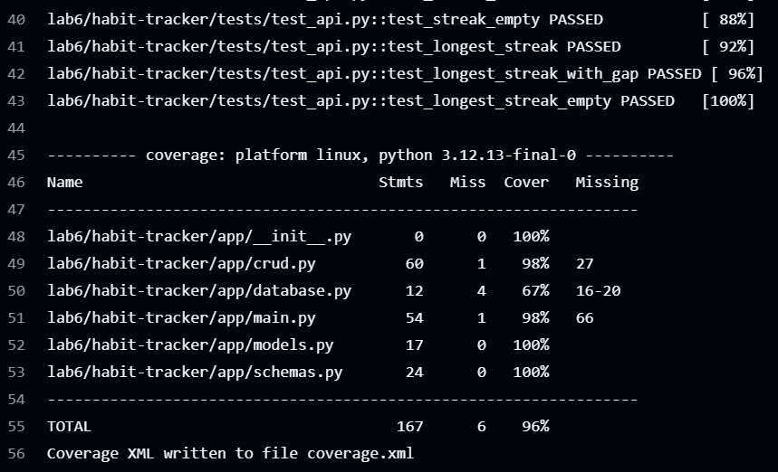

---

## Змінні середовища

| Змінна              | Опис                                                    | Дефолт       |
| ------------------- | ------------------------------------------------------- | ------------ |
| `POSTGRES_USER`     | Ім'я користувача PostgreSQL                             | `habit_user` |
| `POSTGRES_PASSWORD` | Пароль PostgreSQL                                       | `habit_pass` |
| `POSTGRES_DB`       | Назва БД                                                | `habit_db`   |
| `DATABASE_URL`      | Повний URL з'єднання (формується автоматично в compose) | —            |
| `APP_PORT`          | Зовнішній порт додатку                                  | `8000`       |

Налаштування:

```bash
cp .env.example .env
```

---

## Demo

Система готова до production: автоматична документація, CI/CD pipeline, Docker розгортання та повний набір тестів.

_Рисунок 8.1 - Swagger UI документація API з розгорнутими ендпоінтами_

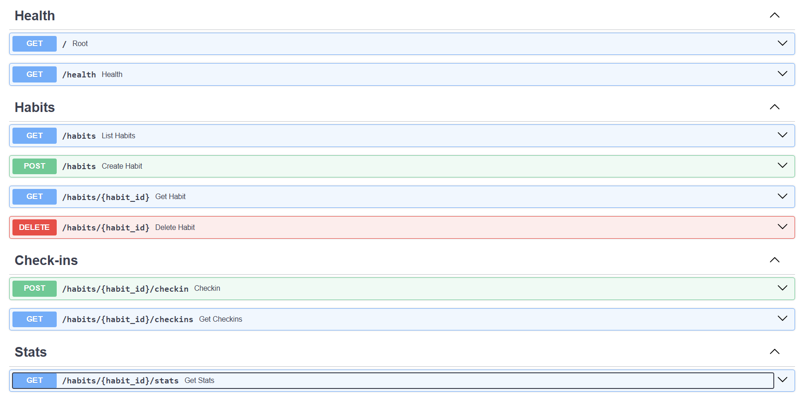

_Рисунок 8.2 - Статус CI/CD pipeline в GitHub Actions_


_Рисунок 8.3 - Візуалізація успішного CI/CD pipeline в GitHub Actions_

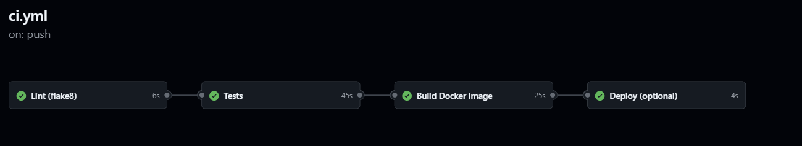

_Рисунок 8.4 - Детальний звіт про покриття коду тестами_

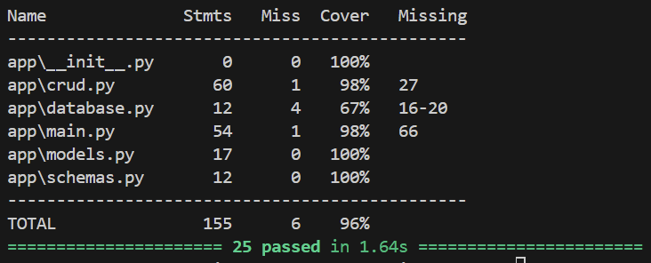

_Рисунок 8.5 - Демонстрація роботи Habit Tracker в Docker контейнерах_


_Рисунок 8.6 - Демонстрація автоматичного CI/CD процесу в GitHub Actions_

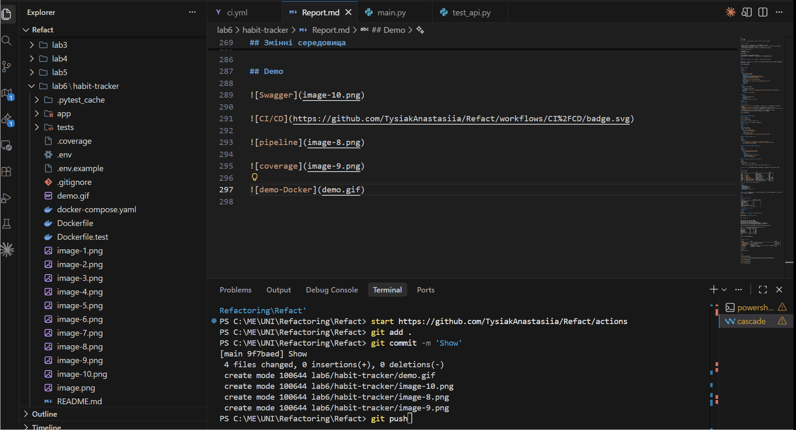
