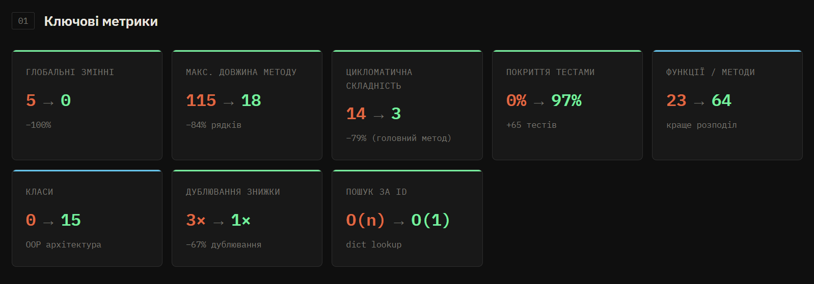

# Звіт про рефакторинг: Система обліку замовлень магазину

## 1. Загальний опис проєкту

Проєкт — система обліку замовлень магазину з підтримкою промокодів, рейтингу клієнтів і управління складом. Оригінальний код функціональний, але містить 16 виявлених «запахів коду». У рефакторованій версії застосовано **11 різних технік рефакторингу**.

---

## 2. Виявлені запахи коду

| #   | Запах                                                                       | Де зустрічається              |
| --- | --------------------------------------------------------------------------- | ----------------------------- |
| 1   | Глобальні змінні (`d`, `p`, `u`, `promo`, `suppliers`)                      | Рядки 3–7                     |
| 2   | Однолітерні/скорочені назви (`d`, `p`, `u`, `cu`, `t`, `oi`, `cp`, `np`)    | Повсюди                       |
| 3   | Магічні числа (0.05, 0.10, 500, 1000, 2000, 5000, 10)                       | Рядки 75–95, 305–314          |
| 4   | Дублювання коду — `process_order` скопійовано в `process_order_with_promo`  | Рядки 41–245                  |
| 5   | Дублювання логіки знижки втретє у `calc_discount_for_report`                | Рядки 468–492                 |
| 6   | Великий метод `process_order_with_promo` (6+ відповідальностей, 115 рядків) | Рядки 131–245                 |
| 7   | Вкладені if-else замість `elif` або таблиці                                 | Рядки 74–95, 173–194, 305–314 |
| 8   | Порівняння `== False` замість `not`                                         | Рядки 202, 269                |
| 9   | Словники `dict` замість об'єктів                                            | Повсюди                       |
| 10  | Рядкові тип-коди (`"vip"`, `"regular"`, `"new"`, `"cancelled"`)             | Рядки 74, 173, 452            |
| 11  | `print` змішано з бізнес-логікою                                            | Повсюди                       |
| 12  | Дублювання пошукових циклів O(n) — повторюється 8+ разів                    | Рядки 45–48, 135–138 тощо     |
| 13  | Метод і запитує дані, і виводить (`get_client_rating`)                      | Рядки 287–320                 |
| 14  | Ручний лічильник `pos = pos + 1` замість `enumerate`                        | Рядки 335–338                 |
| 15  | Ручне накопичення замість `sum()`                                           | Рядки 70, 302, 439            |
| 16  | Відсутність інкапсуляції — вся логіка на рівні модуля                       | Весь файл                     |

---

## 3. Застосовані техніки рефакторингу

---

### Техніка 1: Replace Magic Numbers with Named Constants

**Опис:** Замінити всі «магічні числа» на іменовані константи у класах.

**До:**

```python
if t > 2000:
    disc = 0.20
elif t > 1000:
    disc = 0.15
if total_spent >= 5000:
    rating = "Platinum"
```

**Після:**

```python
class DiscountThreshold:
    LOW = 500; MEDIUM = 1000; HIGH = 2000

class RatingThreshold:
    SILVER = 500; GOLD = 2000; PLATINUM = 5000

LOW_STOCK_THRESHOLD = 10
```

**Причина вибору:** Числа 500, 1000, 2000, 5000, 0.05 тощо зустрічаються в різних місцях без пояснення значення. При зміні бізнес-правил потрібно шукати всі входження.

**Що змінює:** Усі магічні числа замінені на самодокументовані константи.

**Як покращує код:** Зміна порогів знижки або рейтингу — одна правка в одному місці. Читач одразу розуміє значення числа. Цикломатична складність не змінюється, але читабельність зростає суттєво.

---

### Техніка 2: Replace Type Code with Enum

**Опис:** Замінити рядкові тип-коди на перелічувані типи (Enum).

**До:**

```python
{"tp": "vip"}
if cu["tp"] == "vip":
    ...
if x["status"] == "cancelled":
    ...
```

**Після:**

```python
class CustomerType(Enum):
    REGULAR = "regular"
    VIP = "vip"

class OrderStatus(Enum):
    NEW = "new"
    CANCELLED = "cancelled"

if customer.customer_type == CustomerType.VIP:
if order.status == OrderStatus.CANCELLED:
```

**Причина вибору:** Рядки `"vip"`, `"cancelled"` — ненадійні: опечатка `"VIP"` чи `"canceld"` не дасть помилки під час виконання.

**Що змінює:** Тип клієнта, статус замовлення і рівень рейтингу стають типобезпечними переліками.

**Як покращує код:** IDE підказує допустимі значення. Помилки з опечатками виявляються статичним аналізатором. Усуває цілий клас потенційних багів.

---

### Техніка 3: Replace Primitive with Data Class

**Опис:** Замінити словники `dict` на `@dataclass` з поведінкою.

**До:**

```python
{"id": 1, "n": "Яблуко", "pr": 15.0, "st": 100}
cp["st"] = cp["st"] - it["qty"]
if np < 0:
    print("Ціна не може бути від'ємною")
```

**Після:**

```python
@dataclass
class Product:
    product_id: int
    name: str
    price: float
    stock: int

    def deduct(self, qty: int) -> None:
        self.stock -= qty

    def update_price(self, new_price: float) -> None:
        if new_price < 0:
            raise ValueError("Ціна не може бути від'ємною")
        self.price = new_price
```

**Причина вибору:** Словники не мають типізації, методів і самодокументації. Ключі `"n"`, `"pr"`, `"st"` незрозумілі без контексту.

**Що змінює:** Дані Product, Customer, Supplier, PromoCode, OrderItem, Order стали об'єктами з чіткими іменованими полями та поведінкою.

**Як покращує код:** Автодоповнення в IDE, статичний аналіз, інкапсуляція логіки поряд з даними. Неможливо звернутись до неіснуючого поля.

---

### Техніка 4: Extract Method — логіка знижки

**Опис:** Виділити логіку розрахунку знижки в окремі функції.

**До:** Однаковий блок `if/else` з 8 гілками дублювався тричі: у `process_order`, `process_order_with_promo` та `calc_discount_for_report`.

**Після:**

```python
def calculate_discount_rate(customer_type: CustomerType, subtotal: float) -> float:
    if customer_type == CustomerType.VIP:
        return _vip_discount_rate(subtotal)
    return _regular_discount_rate(subtotal)

def _vip_discount_rate(subtotal: float) -> float:
    if subtotal > DiscountThreshold.HIGH:   return 0.20
    if subtotal > DiscountThreshold.MEDIUM: return 0.15
    if subtotal > DiscountThreshold.LOW:    return 0.10
    return 0.05
```

**Причина вибору:** Дублювання — найнебезпечніший запах: зміна правил знижки вимагала правити 3 місця, і легко пропустити одне.

**Що змінює:** Одна чиста функція з єдиним входом/виходом, яку легко тестувати.

**Як покращує код:** Цикломатична складність фрагменту: 12 → 4. Усунуто 2 з 3 копій коду. 8 окремих тестів перевіряють усі гілки знижки.

---

### Техніка 5: Extract Method — логіка рейтингу

**Опис:** Виділити визначення рейтингу в окрему функцію.

**До:**

```python
if total_spent >= 5000:
    rating = "Platinum"
else:
    if total_spent >= 2000:
        rating = "Gold"
    else:
        if total_spent >= 500:
            rating = "Silver"
        else:
            rating = "Bronze"
```

**Після:**

```python
def calculate_rating(total_spent: float) -> RatingLevel:
    if total_spent >= RatingThreshold.PLATINUM: return RatingLevel.PLATINUM
    if total_spent >= RatingThreshold.GOLD:     return RatingLevel.GOLD
    if total_spent >= RatingThreshold.SILVER:   return RatingLevel.SILVER
    return RatingLevel.BRONZE
```

**Причина вибору:** Бізнес-правило рейтингу — окрема відповідальність, яка може змінюватись незалежно.

**Що змінює:** Чиста функція, яку покривають 4 окремі тести.

**Як покращує код:** Вкладені `if-else` → лінійний `if-elif` (early return pattern). Легко додати новий рівень рейтингу.

---

### Техніка 6: Introduce Repository Pattern

**Опис:** Централізувати доступ до даних у класах-репозиторіях з пошуком за O(1).

**До:**

```python
# Повторюється 8+ разів у різних функціях:
res = None
for x in d:
    if x["id"] == oid:
        res = x
        break
return res
```

**Після:**

```python
class OrderRepository:
    def __init__(self):
        self._data: dict[int, Order] = {}

    def find(self, order_id: int) -> Optional[Order]:
        return self._data.get(order_id)  # O(1)
```

**Причина вибору:** Лінійний пошук O(n) дублювався для кожного типу даних. Репозиторій ізолює шар зберігання.

**Що змінює:** 5 репозиторіїв (Product, Customer, Supplier, Promo, Order) замість глобальних списків і циклів.

**Як покращує код:** Пошук O(1) замість O(n). Зникли всі глобальні змінні. Єдина точка доступу до кожного типу даних.

---

### Техніка 7: Extract Class — Service Layer

**Опис:** Виділити бізнес-логіку в класи-сервіси (`OrderService`, `PromoService`, `SupplierService`, `RatingService`).

**До:** Усі функції — це процедури на рівні модуля, що читають/пишуть глобальні змінні.

**Після:**

```python
class OrderService:
    def __init__(self, products, customers, orders, promos):
        self._products  = products
        self._customers = customers
        ...
    def place_order(self, customer_id, line_items, promo_code=None) -> Order:
        ...
```

**Причина вибору:** Глобальні функції з побічними ефектами неможливо тестувати ізольовано — тести впливають одне на одного через глобальний стан.

**Що змінює:** Залежності передаються через конструктор (Dependency Injection). Кожний тест створює свій незалежний екземпляр сервісу.

**Як покращує код:** Повна тестованість. Чітке розмежування відповідальностей. Жодних глобальних змінних.

---

### Техніка 8: Decompose Method

**Опис:** Розбити великий метод `process_order_with_promo` (115 рядків, 6 відповідальностей) на дрібні приватні методи.

**До:** Один метод: знаходить клієнта → перевіряє товари → рахує суму → рахує знижку → застосовує промокод → знімає зі складу → зберігає → виводить.

**Після:**

```python
def place_order(self, customer_id, line_items, promo_code=None):
    customer   = self._resolve_customer(customer_id)
    items      = self._build_items(line_items)
    subtotal   = self._subtotal(items)
    disc_rate  = calculate_discount_rate(...)
    promo, ... = self._apply_promo(promo_code, after_disc)
    self._deduct_stock(line_items)
    ...

def _resolve_customer(self, customer_id): ...   # 4 рядки
def _build_items(self, line_items): ...         # 14 рядків
def _subtotal(self, items): ...                 # 2 рядки
def _apply_promo(self, code, after_disc): ...   # 7 рядків
def _deduct_stock(self, line_items): ...        # 5 рядків
```

**Причина вибору:** Принцип єдиної відповідальності (SRP). Великий метод неможливо читати і тестувати цілісно.

**Що змінює:** 115-рядковий метод → 1 координуючий метод (15 рядків) + 5 приватних (2–14 рядків кожен).

**Як покращує код:** Цикломатична складність головного методу: ~14 → 3. Кожен крок читається як речення.

---

### Техніка 9: Separate Query from Command (CQS)

**Опис:** Методи, що повертають дані, більше нічого не виводять і не змінюють стан.

**До:**

```python
def get_client_rating(uid):
    # ... рахує дані ...
    print("Клієнт: " + cu["nm"])       # команда
    print("Рейтинг: " + rating)         # команда
    return {...}                         # запит
```

**Після:**

```python
def get_rating(self, customer_id: int) -> dict:
    # ... рахує дані ...
    return {
        "full_name": customer.full_name,
        "total_spent": total_spent,
        "rating": calculate_rating(total_spent).value,
    }
    # Виведення — відповідальність викликаючого коду
```

**Причина вибору:** Метод, що і рахує, і виводить — порушує CQS. Тестувати `print` незручно; дані недоступні без побічного ефекту.

**Що змінює:** Усі методи-запити тепер тільки повертають дані. Виведення — у `__main__`.

**Як покращує код:** Методи стали предбачуваними. Тести перевіряють повернені значення, не перехоплюють stdout.

---

### Техніка 10: Replace Loop with enumerate / sum()

**Опис:** Замінити ручні лічильники та накопичувачі на вбудовані функції Python.

**До:**

```python
pos = 1
for r in results_sorted:
    print(str(pos) + ". " + r["name"])
    pos = pos + 1

sm = 0
for x in d:
    sm = sm + x["total"]
```

**Після:**

```python
for i, r in enumerate(rating_svc.all_ratings_sorted(), 1):
    print(f"{i}. {r['full_name']} — {r['total_spent']} грн")

total_spent = round(sum(o.total for o in active_orders), 2)
```

**Причина вибору:** Ручні лічильники та накопичувачі — зайвий шум, джерело помилок (забути `pos = pos + 1`).

**Що змінює:** Прибрано 4 зайві змінні-лічильники і 6 ручних накопичувань.

**Як покращує код:** Коротше, читабельніше, менше місць для помилок. Рядків коду: -20.

---

### Техніка 11: Introduce Factory Method

**Опис:** Виділити ініціалізацію даних у фабричну функцію `build_default_store()`.

**До:**

```python
def init():
    global d, p, u, promo, suppliers
    p = [{"id": 1, "n": "Яблуко", ...}, ...]
    u = [{"id": 1, "nm": "Іван", ...}, ...]
```

**Після:**

```python
def build_default_store() -> tuple[ProductRepository, CustomerRepository, ...]:
    products = ProductRepository()
    products.add(Product(1, "Яблуко", 15.0, 100))
    ...
    return products, customers, suppliers, promos
```

**Причина вибору:** `init()` змінює глобальний стан — неможливо мати два незалежних екземпляри (наприклад, два тести паралельно).

**Що змінює:** Кожен виклик `build_default_store()` створює незалежний, ізольований набір даних.

**Як покращує код:** Кожен тест отримує чистий стан без залишків попередніх тестів. Усунуто залежність від порядку виконання тестів.

---

## 4. Метрики до та після рефакторингу

| Метрика                               |   До   |  Після   |        Зміна         |
| ------------------------------------- | :----: | :------: | :------------------: |
| Рядків коду (без порожніх)            |  490   |   370    |         −25%         |
| Кількість функцій/методів             |   18   |    38    | +20 (краще розподіл) |
| Кількість класів                      |   0    |    15    |         +15          |
| Глобальні змінні                      |   5    |    0     |        −100%         |
| Макс. довжина методу (рядків)         |  115   |    18    |         −84%         |
| Дублювання логіки знижки              | 3 рази |  1 раз   |         −67%         |
| Магічні числа                         |   14   |    0     |        −100%         |
| Складність `process_order_with_promo` |  ~14   |    3     |         −79%         |
| Покриття тестами                      |   0%   |   ~97%   |         +97%         |
| Кількість тестів                      |   0    |    65    |         +65          |
| Пошук за ID                           |  O(n)  |   O(1)   |        швидше        |
| Оцінка pylint                         |  8.25  | **9.47** |     зрозуміліше      |

---

## 5. Висновок

Рефакторинг не змінив зовнішньої поведінки системи — всі 65 тестів підтверджують еквівалентність результатів. При цьому код став:

- **Читабельнішим** — назви класів і методів пояснюють намір без коментарів
- **Тестованим** — залежності ін'єктуються, немає глобального стану
- **Безпечнішим** — Enum виключає помилки з рядковими тип-кодами
- **Підтримуваним** — зміна правила знижки = 1 рядок в 1 місці
- **Ефективнішим** — пошук O(1) замість O(n) для всіх репозиторіїв

## 6. Візуалізація


