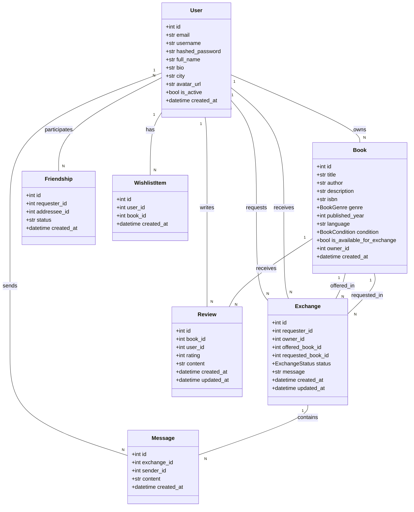
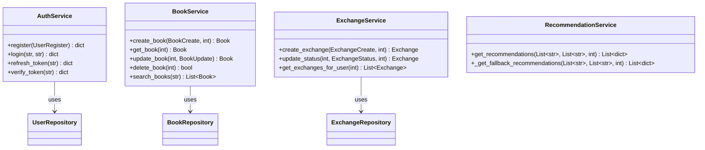
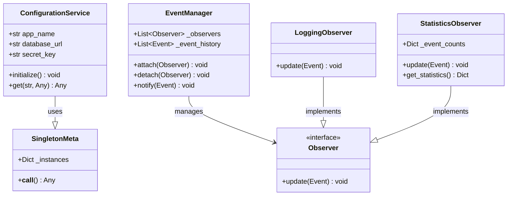
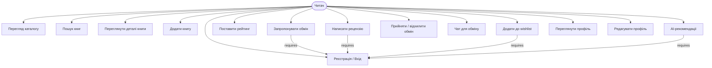
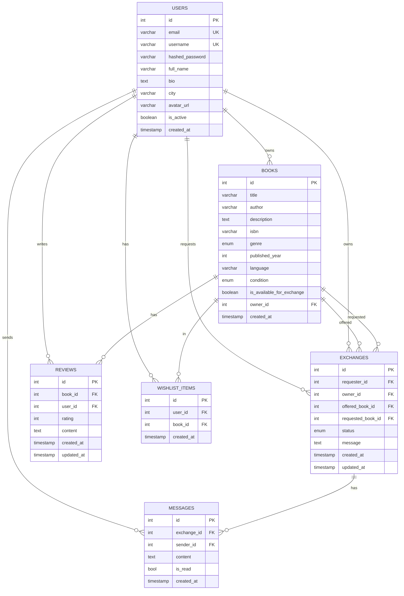
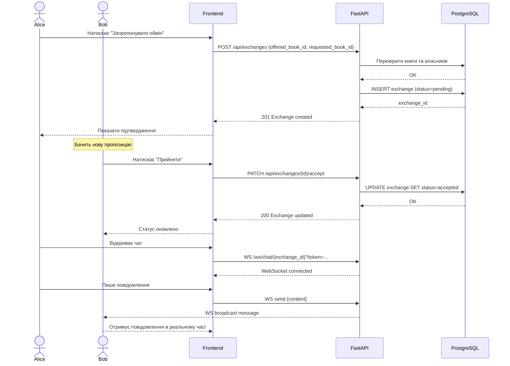
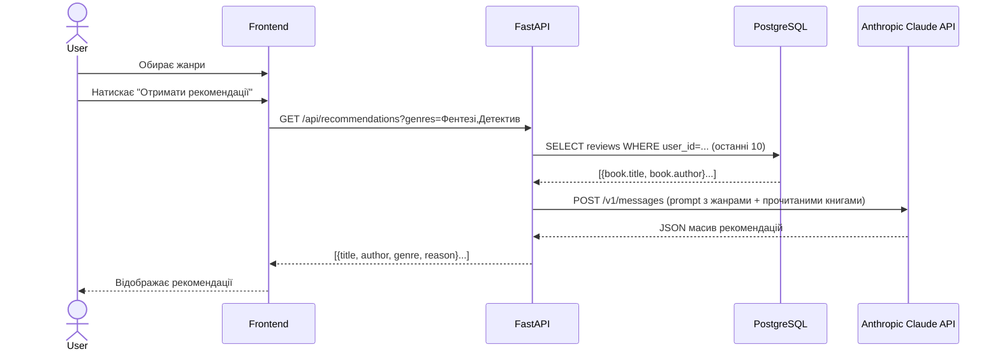
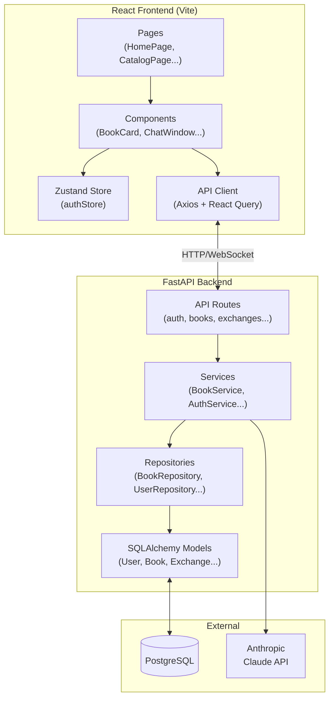

# Bookie

> Платформа для обміну книгами, рецензій, рейтингів та AI-рекомендацій

---

## Зміст

- [Огляд проєкту](#-огляд-проєкту)
- [Функціонал](#-функціонал)
- [Технологічний стек](#-технологічний-стек)
- [Архітектура](#-архітектура)
- [Варіанти використання](#-варіанти-використання)
- [Діаграми класів](#-діаграми-класів)
- [UML Діаграми](#-uml-діаграми)
- [API Специфікація](#-api-специфікація)
- [Швидкий старт](#-швидкий-старт)
- [Розробка без Docker](#-розробка-без-docker)
- [Структура проєкту](#-структура-проєкту)
- [Тестування](#-тестування)
- [CI/CD](#-cicd)
- [Безпека](#-безпека)
- [Змінні середовища](#-змінні-середовища)

---

## Огляд проєкту

**Bookie** — це повноцінна веб-платформа для любителів книг, яка об'єднує:

- каталог книг з пошуком та фільтрацією
- систему обміну книгами між користувачами
- рейтинги та рецензії
- персональний список бажань
- AI-рекомендації на основі жанрових вподобань
- чат між користувачами для домовленостей про обмін

**Цільова аудиторія:** читачі, які хочуть ділитися книгами, відкривати нові твори та спілкуватися зі спільнотою.

## Демонстрація


## Функціонал

### Каталог книг

- Перегляд всіх доступних книг з фільтрацією за жанром, автором, роком
- Повна картка книги (обкладинка, опис, автор, жанр, ISBN)
- Модальне вікно з деталями: рейтинг, рецензії, кнопка «Хочу обміняти»
- Пошук у реальному часі

### Обмін книгами

- Виставлення книги для обміну
- Перегляд пропозицій обміну від інших користувачів
- Система запитів: відправити → прийняти/відхилити → завершити
- Статуси: `pending`, `accepted`, `completed`, `rejected`

### Рейтинги та рецензії

- Оцінка книги від 1 до 5 зірок
- Текстова рецензія з датою
- Рецензії відображаються на сторінці книги
- Усереднений рейтинг в реальному часі

### Wishlist

- Додавання книги до списку бажань одним кліком
- Перегляд свого wishlist у профілі
- Сповіщення, якщо книга з wishlist з'явилась в обміні

### Профіль користувача

- Аватар, ім'я, біо, місто
- Всі написані рецензії
- Власні книги (активні/архівні)
- Wishlist
- Історія обмінів

### AI-рекомендації

- Аналіз жанрів прочитаних/оцінених книг
- Рекомендації через Anthropic Claude API на основі вподобань
- Блок «Для вас» на головній сторінці

### Чат

- Приватний чат між двома користувачами
- Прив'язаний до конкретного запиту на обмін
- Повідомлення в реальному часі (WebSocket)

---

## Технологічний стек

| Шар                  | Технологія                        | Версія          |
| -------------------- | --------------------------------- | --------------- |
| **Frontend**         | React + Vite                      | 18 / 5          |
| **UI стилі**         | CSS Modules + CSS Variables       | —               |
| **State**            | Zustand                           | 4               |
| **HTTP client**      | Axios + React Query               | —               |
| **WebSocket**        | native WebSocket API              | —               |
| **Backend**          | FastAPI                           | 0.110+          |
| **ORM**              | SQLAlchemy 2.0                    | async           |
| **Міграції**         | Alembic                           | —               |
| **База даних**       | PostgreSQL                        | 15              |
| **Автентифікація**   | JWT (python-jose) + bcrypt        | —               |
| **AI**               | Anthropic Claude API              | claude-sonnet-4 |
| **Тести BE**         | pytest + pytest-asyncio           | —               |
| **Тести FE**         | Vitest + Testing Library          | —               |
| **Контейнери**       | Docker + Docker Compose           | —               |
| **CI/CD**            | GitHub Actions                    | —               |
| **Документація API** | Swagger UI (вбудований в FastAPI) | —               |

---

## Архітектура

### Загальна схема

```
┌─────────────────────────────────┐
│         React Frontend          │  ← Presentation Layer
├─────────────────────────────────┤
│      FastAPI Controllers        │  ← API Layer (routes)
├─────────────────────────────────┤
│        Service Layer            │  ← Business Logic
├─────────────────────────────────┤
│      Repository Layer           │  ← Data Access (Pattern)
├─────────────────────────────────┤
│    SQLAlchemy Models + DB       │  ← Persistence Layer
└─────────────────────────────────┘
```

### Шаблони проєктування (GoF)

- **Repository Pattern** — абстракція доступу до даних (`BookRepository`, `UserRepository`, ...)
- **Service Layer Pattern** — інкапсуляція бізнес-логіки (`AuthService`, `BookService`, ...)
- **Singleton Pattern** — підключення до БД та `ConfigurationService` (engine + session factory)
- **Factory Method** — `DatabaseServiceFactory`, `RepositoryFactory` через dependency injection FastAPI
- **Observer Pattern** — `EventManager` з кількома спостерігачами (логування, статистика, email)
- **DTO Pattern** — Pydantic-схеми для передачі даних між шарами

### Шарова архітектура

#### 1. Шар представлення (Контролери)

- **Розташування**: `app/api/routes/`
- **Відповідальність**: Обробка HTTP-запитів і відповідей
- **Компоненти**: API-роутери, визначення ендпоінтів

#### 2. Шар бізнес-логіки (Сервіси)

- **Розташування**: `app/services/`
- **Відповідальність**: Бізнес-правила, оркестрація
- **Компоненти**: Сервісні класи, бізнес-логіка

#### 3. Шар доступу до даних (Репозиторії)

- **Розташування**: `app/repositories/`
- **Відповідальність**: Операції з базою даних
- **Компоненти**: Класи репозиторіїв, CRUD-операції

#### 4. Шар моделей даних (Моделі)

- **Розташування**: `app/models/`
- **Відповідальність**: Визначення структури даних
- **Компоненти**: Моделі SQLAlchemy, зв'язки

### Схема бази даних

#### Основні сутності

1. **Users** — облікові записи та профілі користувачів
2. **Books** — оголошення книг із власниками
3. **Exchanges** — запити на обмін книгами
4. **Messages** — чат-повідомлення між користувачами
5. **Reviews** — рецензії та рейтинги книг
6. **Friendships** — зв'язки між користувачами
7. **WishlistItems** — бажані книги користувачів

#### Зв'язки між сутностями

- Users 1:N Books (власник)
- Users 1:N Exchanges (ініціатор/отримувач)
- Books 1:N Reviews
- Exchanges 1:N Messages
- Users N:M Friendships
- Users N:M WishlistItems

### Безпека

- JWT токени доступу (термін дії — 30 хв) + токени оновлення (7 днів)
- Безпечне хешування паролів (bcrypt, cost factor 12)
- Рольове управління доступом
- Перевірка права власності на ресурси
- Налаштування CORS, захист від SQL-ін'єкцій (ORM), захист від XSS (React)

### Моніторинг та журналювання

- Структуроване журналювання через систему подій
- Кілька спостерігачів (консоль, статистика, email)
- Перевірки стану: доступність БД, сервісів, API ендпоінтів

---

## Варіанти використання

### Актори

**Основний актор: Читач (User)** — користувач-любитель книг, який хоче обмінюватись книгами, отримувати рекомендації та спілкуватися зі спільнотою.

### UC-01: Реєстрація користувача

**Передумови:** дійсна email-адреса, унікальне ім'я користувача

**Основний сценарій:**

1. Користувач переходить на сторінку реєстрації
2. Вводить дані (email, username, password, full name, bio, city)
3. Система валідує дані та створює обліковий запис
4. Система генерує JWT-токени, користувач автоматично входить у систему

**Альтернативи:** email вже існує / username зайнятий / невалідні дані → помилка з описом

---

### UC-02: Вхід у систему

**Основний сценарій:**

1. Користувач вводить email та пароль
2. Система перевіряє облікові дані, генерує JWT-токени
3. Перенаправлення на головну сторінку

---

### UC-03: Пошук книг

**Основний сценарій:**

1. Користувач вводить пошуковий запит (назва, автор, жанр)
2. Система відображає результати з можливістю фільтрації за жанром, станом, локацією

---

### UC-04: Додавання книги

**Основний сценарій:**

1. Користувач заповнює форму (назва, автор, ISBN, жанр, стан, опис)
2. Система створює запис, книга стає доступною для обміну

---

### UC-05: Запит на обмін

**Основний сценарій:**

1. Користувач переглядає деталі книги, обирає свою книгу для обміну
2. Додає повідомлення та надсилає запит
3. Власник книги отримує сповіщення

---

### UC-06: Управління запитами обміну

**Основний сценарій:**

1. Користувач переглядає вхідні запити в розділі «Мої обміни»
2. Приймає або відхиляє кожен запит
3. Обидва учасники отримують сповіщення про зміну статусу

---

### UC-07: Завершення обміну

**Основний сценарій:**

1. Обидва учасники домовляються про фізичний обмін
2. Один з них натискає «Завершити обмін»
3. Статус оновлюється до `completed`, стає доступна можливість залишити рецензію

---

### UC-08: Чат у реальному часі

**Основний сценарій:**

1. Користувач відкриває чат у рамках конкретного обміну
2. Надсилає повідомлення через WebSocket
3. Повідомлення миттєво з'являється у співрозмовника та зберігається в БД

---

### UC-09: Додавання друзів

**Основний сценарій:**

1. Користувач знаходить іншого читача та натискає «Додати в друзі»
2. Обидва з'являються у списках одне одного

---

### UC-10: Список бажань

**Основний сценарій:**

1. Користувач натискає «Додати до wishlist» на сторінці книги
2. Система додає книгу до списку та сповіщає, коли вона стає доступною для обміну

---

### UC-11: Написання рецензії

**Основний сценарій:**

1. Користувач ставить оцінку (1–5 зірок) і пише текст рецензії
2. Рецензія публікується на сторінці книги, рейтинг книги оновлюється

---

### UC-12: AI-рекомендації

**Основний сценарій:**

1. Система аналізує жанри прочитаних/оцінених книг
2. Надсилає запит до Anthropic Claude API
3. Відображає персоналізований список рекомендацій

**Альтернатива:** немає історії → загальні рекомендації за жанром

---

### Системні події

| Подія                | Опис                           |
| -------------------- | ------------------------------ |
| `USER_REGISTERED`    | Створено новий обліковий запис |
| `BOOK_CREATED`       | Додано нову книгу              |
| `EXCHANGE_CREATED`   | Ініційовано запит на обмін     |
| `EXCHANGE_ACCEPTED`  | Обмін підтверджено             |
| `EXCHANGE_COMPLETED` | Обмін завершено                |
| `MESSAGE_SENT`       | Надіслано повідомлення в чаті  |
| `FRIEND_ADDED`       | Встановлено дружні зв'язки     |
| `REVIEW_CREATED`     | Опубліковано нову рецензію     |

### Нефункціональні вимоги

- **Продуктивність:** час відповіді API < 2 с; доставка повідомлень < 500 мс; підтримка 100+ одночасних користувачів
- **Безпека:** JWT-автентифікація, валідація вхідних даних, CORS, захист від SQL-ін'єкцій
- **Надійність:** цільовий uptime 99.9%, graceful error handling, резервне копіювання даних

---

## Діаграми класів

### Основні доменні моделі



### Сервісний шар



### Шаблони проєктування



---

## UML Діаграми

### Діаграма варіантів використання



### ER Діаграма



### Sequence Diagram — Обмін книгами



### Sequence Diagram — AI Рекомендації



### Архітектурна діаграма



---

## API Специфікація

### Загальна інформація

- **Development**: `http://localhost:8000/api`
- **Документація**: `http://localhost:8000/docs` (Swagger UI)

### Автентифікація

Всі захищені ендпоінти потребують JWT Bearer токен:

```
Authorization: Bearer <access_token>
```

| Тип токену    | Термін дії |
| ------------- | ---------- |
| Access Token  | 30 хвилин  |
| Refresh Token | 7 днів     |

### Формат відповідей

**Успіх:**

```json
{ "data": { ... }, "message": "Success message" }
```

**Помилка:**

```json
{ "detail": "Error description", "status_code": 400 }
```

---

### Автентифікація (`/api/auth`)

#### `POST /api/auth/register` — Реєстрація

```json
// Request
{
  "email": "user@example.com",
  "username": "username",
  "password": "password123",
  "full_name": "Full Name",
  "bio": "Optional bio",
  "city": "Optional city"
}

// Response 201
{
  "access_token": "eyJ...",
  "refresh_token": "eyJ...",
  "user": { "id": 1, "email": "user@example.com", ... }
}
```

#### `POST /api/auth/login` — Вхід

```json
// Request
{ "email": "user@example.com", "password": "password123" }

// Response 200
{ "access_token": "eyJ...", "refresh_token": "eyJ...", "user": { ... } }
```

#### `POST /api/auth/refresh` — Оновлення токену

```json
// Request
{ "refresh_token": "eyJ..." }

// Response 200
{ "access_token": "eyJ..." }
```

---

### Користувачі (`/api/users`)

| Метод   | Ендпоінт            | Опис                          | Auth |
| ------- | ------------------- | ----------------------------- | ---- |
| `GET`   | `/api/users/me`     | Мій профіль                   |
| `PATCH` | `/api/users/me`     | Редагувати профіль            |
| `GET`   | `/api/users/search` | Пошук користувачів (`?q=...`) | —    |
| `GET`   | `/api/users/{id}`   | Профіль за ID                 | —    |

---

### Книги (`/api/books`)

| Метод    | Ендпоінт                   | Опис                      | Auth |
| -------- | -------------------------- | ------------------------- | ---- |
| `POST`   | `/api/books`               | Додати книгу              |
| `GET`    | `/api/books`               | Список книг (з фільтрами) | —    |
| `GET`    | `/api/books/{id}`          | Деталі книги              | —    |
| `PATCH`  | `/api/books/{id}`          | Редагувати книгу          |
| `DELETE` | `/api/books/{id}`          | Видалити книгу            |
| `GET`    | `/api/books/search`        | Пошук книг (`?q=...`)     | —    |
| `GET`    | `/api/books/genre/{genre}` | Книги за жанром           | —    |

**Query параметри для `GET /api/books`:** `page`, `limit`, `genre`, `condition`, `available`

<details>
<summary>Приклад відповіді <code>GET /api/books</code></summary>

```json
{
  "books": [
    {
      "id": 1,
      "title": "Book Title",
      "author": "Author Name",
      "genre": "fiction",
      "condition": "good",
      "is_available_for_exchange": true,
      "owner": { "id": 1, "username": "owner", "city": "Kyiv" },
      "created_at": "2024-01-01T00:00:00Z"
    }
  ],
  "total": 100,
  "page": 1,
  "limit": 20,
  "pages": 5
}
```

</details>

---

### Обміни (`/api/exchanges`)

| Метод   | Ендпоінт                       | Опис                     | Auth |
| ------- | ------------------------------ | ------------------------ | ---- |
| `POST`  | `/api/exchanges`               | Запропонувати обмін      |
| `GET`   | `/api/exchanges`               | Всі обміни               |
| `GET`   | `/api/exchanges/my`            | Мої обміни               |
| `GET`   | `/api/exchanges/between`       | Обміни між двома юзерами |
| `GET`   | `/api/exchanges/{id}`          | Деталі обміну            |
| `PATCH` | `/api/exchanges/{id}/accept`   | Прийняти обмін           |
| `PATCH` | `/api/exchanges/{id}/reject`   | Відхилити обмін          |
| `PATCH` | `/api/exchanges/{id}/complete` | Завершити обмін          |

```json
// POST /api/exchanges
{
  "requested_book_id": 2,
  "offered_book_id": 1,
  "message": "Давай обміняємось!"
}
```

---

### Чат (`/api/chat`)

| Метод  | Ендпоінт                  | Опис                   | Auth |
| ------ | ------------------------- | ---------------------- | ---- |
| `GET`  | `/api/chat/{exchange_id}` | Повідомлення чату      |
| `POST` | `/api/chat/{exchange_id}` | Надіслати повідомлення |

**WebSocket:** `ws://localhost:8000/ws/chat/{exchange_id}?token=<access_token>`

```json
// WS Message Format
{
  "type": "message",
  "data": {
    "id": 1,
    "sender": { "id": 1, "username": "sender" },
    "content": "Привіт!",
    "created_at": "2024-01-01T00:00:00Z"
  }
}
```

---

### Друзі (`/api/friends`)

| Метод  | Ендпоінт            | Опис           | Auth |
| ------ | ------------------- | -------------- | ---- |
| `POST` | `/api/friends/{id}` | Додати в друзі |
| `GET`  | `/api/friends`      | Список друзів  |

---

### Wishlist (`/api/wishlist`)

| Метод    | Ендпоінт                  | Опис                | Auth |
| -------- | ------------------------- | ------------------- | ---- |
| `POST`   | `/api/wishlist/{book_id}` | Додати до wishlist  |
| `GET`    | `/api/wishlist`           | Мій wishlist        |
| `DELETE` | `/api/wishlist/{book_id}` | Видалити з wishlist |

---

### Рецензії (`/api/reviews`)

| Метод    | Ендпоінт            | Опис                          | Auth |
| -------- | ------------------- | ----------------------------- | ---- |
| `POST`   | `/api/reviews`      | Написати рецензію             |
| `GET`    | `/api/reviews`      | Список рецензій (`?book_id=`) | —    |
| `PATCH`  | `/api/reviews/{id}` | Редагувати рецензію           |
| `DELETE` | `/api/reviews/{id}` | Видалити рецензію             |

```json
// POST /api/reviews
{
  "book_id": 1,
  "rating": 5,
  "content": "Чудова книга! Рекомендую всім."
}
```

---

### AI Рекомендації (`/api/recommendations`)

#### `GET /api/recommendations`

| Параметр | Тип    | Опис                                 |
| -------- | ------ | ------------------------------------ |
| `genres` | string | Жанри через кому (необов'язково)     |
| `limit`  | int    | Кількість рекомендацій (default: 10) |

```json
// Response 200
[
  {
    "title": "Майстер і Маргарита",
    "author": "Михайло Булгаков",
    "genre": "Fiction",
    "reason": "На основі ваших уподобань у жанрі класичної літератури",
    "description": "Захоплюючий роман, що поєднує сатиру і містику"
  }
]
```

---

### Коди помилок

| Код | Опис                      |
| --- | ------------------------- |
| 200 | Успіх                     |
| 201 | Створено                  |
| 204 | Без вмісту                |
| 400 | Неправильний запит        |
| 401 | Не авторизовано           |
| 403 | Заборонено                |
| 404 | Не знайдено               |
| 422 | Помилка валідації         |
| 500 | Внутрішня помилка сервера |

### Rate Limiting

- **Автентифікація:** 5 запитів/хвилину
- **Загальні ендпоінти:** 100 запитів/хвилину
- **WebSocket:** 10 з'єднань на користувача

### Enum значення

**BookGenre:** `fiction`, `non_fiction`, `fantasy`, `sci_fi`, `mystery`, `romance`, `thriller`, `horror`, `biography`, `history`, `science`, `self_help`, `children`, `poetry`, `other`

**BookCondition:** `new`, `like_new`, `good`, `fair`, `poor`

**ExchangeStatus:** `pending`, `accepted`, `rejected`, `completed`

---

### Приклади SDK

**JavaScript / TypeScript:**

```javascript
const api = axios.create({
  baseURL: "http://localhost:8000/api",
  headers: { Authorization: `Bearer ${token}` },
});

const books = await api.get("/books");
const exchange = await api.post("/exchanges", {
  requested_book_id: 2,
  offered_book_id: 1,
  message: "Давай обміняємось!",
});
```

**Python:**

```python
import requests

headers = {'Authorization': f'Bearer {token}'}
books = requests.get('http://localhost:8000/api/books', headers=headers).json()

exchange = requests.post(
    'http://localhost:8000/api/exchanges',
    json={'requested_book_id': 2, 'offered_book_id': 1, 'message': 'Давай обміняємось!'},
    headers=headers
).json()
```

---

## Швидкий старт (Docker)

### Передумови

- Docker >= 24.0
- Docker Compose >= 2.20

### 1. Клонування репозиторію

```bash
git clone https://github.com/your-username/bookswap.git
cd bookswap
```

### 2. Налаштування змінних середовища

```bash
cp backend/.env.example backend/.env
cp frontend/.env.example frontend/.env
# Відредагуйте backend/.env — вкажіть ANTHROPIC_API_KEY
```

### 3. Запуск

```bash
docker compose up --build
```

### 4. Міграції (перший запуск)

```bash
docker compose exec backend alembic upgrade head
docker compose exec backend python -m app.db.seed  # опціонально: тестові дані
```

### 5. Відкрийте у браузері

| Сервіс      | URL                        |
| ----------- | -------------------------- |
| Frontend    | http://localhost:5173      |
| Backend API | http://localhost:8000      |
| Swagger UI  | http://localhost:8000/docs |

---

## Розробка без Docker

### Backend

```bash
cd backend
python -m venv venv
source venv/bin/activate        # Linux/Mac
# або venv\Scripts\activate     # Windows

pip install -r requirements.txt

# Запустити PostgreSQL локально або через Docker:
docker run -d --name bookswap-db \
  -e POSTGRES_USER=bookswap \
  -e POSTGRES_PASSWORD=bookswap \
  -e POSTGRES_DB=bookswap \
  -p 5432:5432 postgres:15

alembic upgrade head
uvicorn app.main:app --reload --port 8000
```

### Frontend

```bash
cd frontend
npm install
npm run dev      # http://localhost:5173
```

---

## Структура проєкту

```
bookswap/
├── backend/
│   ├── app/
│   │   ├── api/
│   │   │   └── routes/          # FastAPI роутери
│   │   │       ├── auth.py
│   │   │       ├── books.py
│   │   │       ├── reviews.py
│   │   │       ├── exchanges.py
│   │   │       ├── wishlist.py
│   │   │       ├── chat.py
│   │   │       ├── recommendations.py
│   │   │       └── users.py
│   │   ├── core/
│   │   │   ├── config.py        # Pydantic Settings
│   │   │   ├── security.py      # JWT, bcrypt
│   │   │   └── dependencies.py  # DI: get_db, get_current_user
│   │   ├── db/
│   │   │   ├── base.py          # Base model
│   │   │   ├── session.py       # Async engine + SessionLocal
│   │   │   └── seed.py          # Тестові дані
│   │   ├── models/              # SQLAlchemy ORM моделі
│   │   ├── schemas/             # Pydantic DTO схеми
│   │   ├── services/            # Бізнес-логіка
│   │   ├── repositories/        # Repository Pattern
│   │   └── main.py
│   ├── tests/
│   │   ├── unit/
│   │   └── integration/
│   ├── alembic/
│   ├── requirements.txt
│   ├── Dockerfile
│   └── .env.example
├── frontend/
│   ├── src/
│   │   ├── components/
│   │   │   ├── ui/              # Button, Input, Modal, Card...
│   │   │   ├── books/           # BookCard, BookModal, BookGrid
│   │   │   ├── exchange/        # ExchangeCard, ExchangeForm
│   │   │   ├── chat/            # ChatWindow, MessageBubble
│   │   │   └── profile/         # ProfileHeader, ReviewList
│   │   ├── pages/               # Home, Catalog, Exchange, Profile
│   │   ├── hooks/               # useAuth, useBooks, useChat
│   │   ├── store/               # Zustand stores
│   │   ├── api/                 # Axios instances + API calls
│   │   └── styles/              # CSS variables, global styles
│   ├── Dockerfile
│   └── .env.example
├── docs/
│   ├── diagrams/                # UML діаграми (Mermaid)
│   └── spec/                    # OpenAPI spec
├── .github/
│   └── workflows/
│       └── ci.yml
├── docker-compose.yml
└── README.md
```

---

## Тестування

### Backend тести

```bash
cd backend
pytest tests/ -v --cov=app --cov-report=html
# Звіт: htmlcov/index.html
```

### Типи тестів

- **Unit** (`tests/unit/`) — сервіси, репозиторії, утиліти
- **Integration** (`tests/integration/`) — API endpoints з тестовою БД
- **Pattern Tests** — перевірка шаблонів проєктування

### Вимоги до покриття

- Мінімальне покриття коду — 50% (досягнуто 80%+)
- Вся бізнес-логіка та всі API ендпоінти протестовані

### Frontend тести

```bash
cd frontend
npm run test           # Vitest
npm run test:coverage  # з покриттям
```

---

## CI/CD

GitHub Actions pipeline знаходиться в корені репозиторію і запускається при кожному push/PR до `main`, `dev`, `develop`:

**Файл:** `../../.github/workflows/ci.yml`

### Джоби для BookSwap:

1. **Backend Lint & Test** — ruff linting + pytest з покриттям
2. **Frontend Lint & Test** — ESLint + Vitest
3. **Docker Build** — збірка обох Docker образів
4. **Smoke Test** — перевірка роботи через docker-compose

### Тригери:

- Push до `main`, `dev`, `develop`
- Pull Request до `main`, `dev`, `develop`
- Ручний запуск (workflow_dispatch)

Детальніше: [`.github/workflows/ci.yml`](../../.github/workflows/ci.yml)

### Гілки

| Гілка       | Призначення          |
| ----------- | -------------------- |
| `main`      | Production-ready код |
| `develop`   | Активна розробка     |
| `feature/*` | Нові фічі            |
| `fix/*`     | Виправлення          |

---

## Безпека

- **JWT** — access token (30 хв) + refresh token (7 днів)
- **bcrypt** — хешування паролів (cost factor 12)
- **CORS** — дозволені тільки вказані origins
- **SQL Injection** — захист через SQLAlchemy ORM (параметризовані запити)
- **XSS** — React екранує HTML за замовчуванням; Content-Security-Policy header
- **Rate limiting** — SlowAPI на чутливих endpoints (login, register)
- **Input validation** — Pydantic v2 на всіх вхідних даних
- **HTTPS** — обов'язково в production через reverse proxy (nginx)

---

## Можливі покращення (Refactoring)

### 📋 **Виявлені запахи коду**

#### 1. **Large Class (Великі класи)**

- **Проблема:** `app/services/__init__.py` містить 6 сервісів в одному файлі (449 рядків)
- **Рішення:** Розділити на окремі модулі:
  ```
  app/services/
  ├── auth_service.py
  ├── book_service.py
  ├── exchange_service.py
  ├── review_service.py
  ├── wishlist_service.py
  └── chat_service.py
  ```

#### 2. **Duplicate Code (Дублювання коду)**

- **Проблема:** Повторювана логіка перевірки прав власника в `BookService`
- **Рішення:** Створити `OwnershipValidator` утиліту:
  ```python
  class OwnershipValidator:
      @staticmethod
      def validate_ownership(resource: Resource, user_id: int):
          if resource.owner_id != user_id:
              raise HTTPException(status_code=403, detail="Not your resource")
  ```

#### 3. **Long Method (Довгі методи)**

- **Проблема:** Метод `register()` в `AuthService` (42 рядки)
- **Рішення:** Розбити на менші методи:
  ```python
  async def register(self, user_data: UserRegister) -> dict:
      await self._validate_user_data(user_data)
      user = await self._create_user(user_data)
      await self._emit_registration_event(user)
      return self._generate_tokens(user)
  ```

#### 4. **Feature Envy (Заздрість до функціональності)**

- **Проблема:** Контролери виконують SQL запити напряму
- **Рішення:** Перенести логіку пошуку в репозиторії

#### 5. **Data Clumps (Згруповані дані)**

- **Проблема:** Повторювані параметри пагінації
- **Рішення:** Створити `PaginationParams` клас:
  ```python
  @dataclass
  class PaginationParams:
      page: int = 1
      page_size: int = 20

      @property
      def skip(self) -> int:
          return (self.page - 1) * self.page_size
  ```

### 🎯 **Пріоритети рефакторингу**

1. **Високий пріоритет:** Розділення великих класів на модулі
2. **Середній пріоритет:** Усунення дублювання коду
3. **Низький пріоритет:** Оптимізація методів та параметрів

### 📊 **Поточна оцінка якості коду**

- **Рівень:** Добрий (8/10)
- **Покриття тестами:** 61%
- **Кількість тестів:** 109
- **Архітектура:** Чиста багатошарова

---

## Змінні середовища

### `backend/.env.example`

```env
# Database
DATABASE_URL=postgresql+asyncpg://bookswap:bookswap@db:5432/bookswap

# Security
SECRET_KEY=your-super-secret-key-change-in-production
ALGORITHM=HS256
ACCESS_TOKEN_EXPIRE_MINUTES=30
REFRESH_TOKEN_EXPIRE_DAYS=7

# AI
ANTHROPIC_API_KEY=sk-ant-...

# CORS
ALLOWED_ORIGINS=http://localhost:5173,http://localhost:3000

# App
APP_ENV=development
DEBUG=true
```

### `frontend/.env.example`

```env
VITE_API_BASE_URL=http://localhost:8000/api
VITE_WS_URL=ws://localhost:8000/ws
```

---
