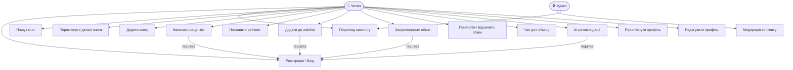
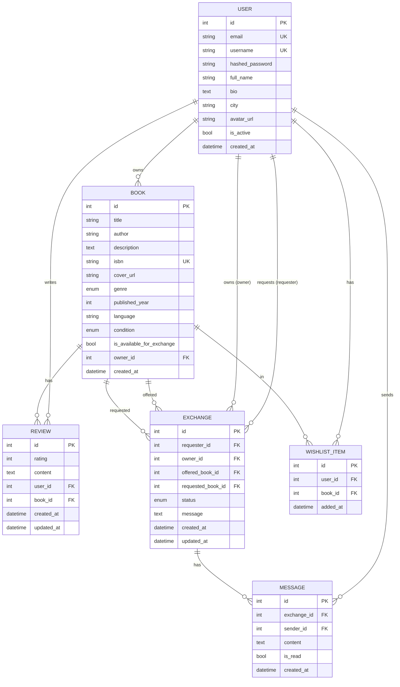
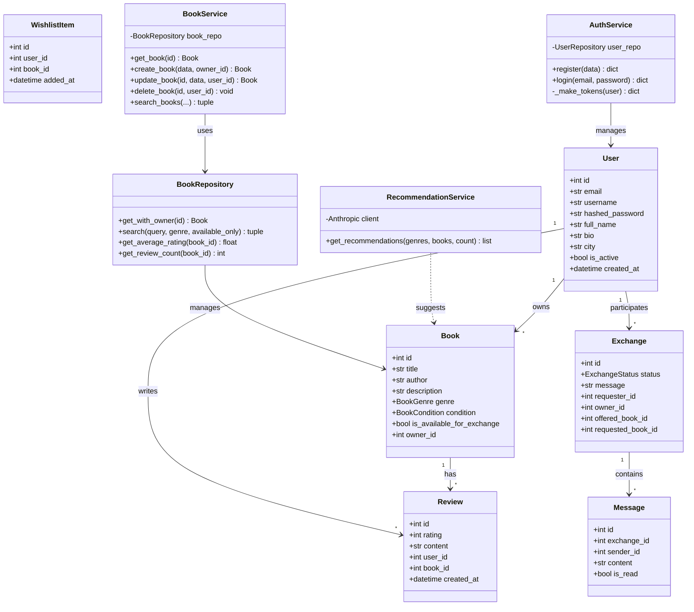
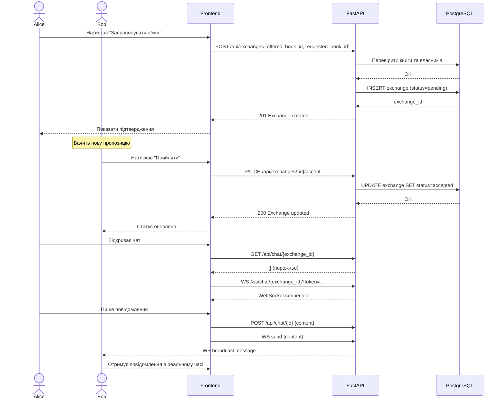
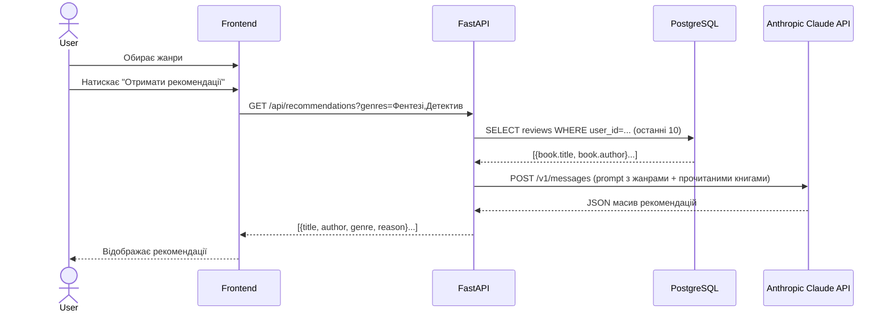
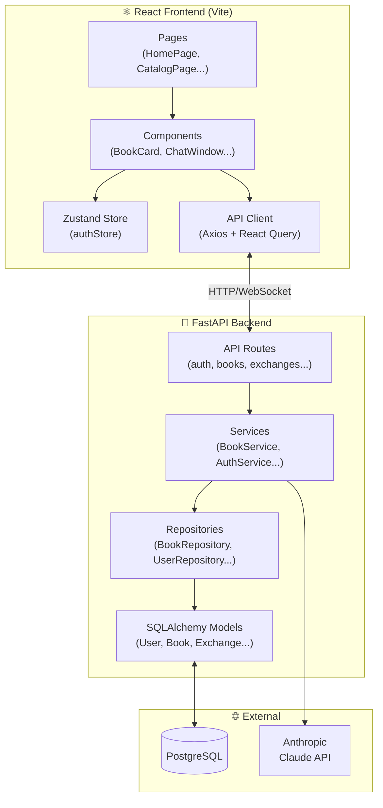

# 📐 UML Діаграми — BookSwap

Скопіюйте код у [mermaid.live](https://mermaid.live) для перегляду.

---

## 1. Use Case Diagram (Діаграма варіантів використання)

---

## 2. Entity Relationship Diagram (ER)

---

## 3. Class Diagram (Діаграма класів)

---

## 4. Sequence Diagram — Exchange Flow

---

## 5. Sequence Diagram — AI Recommendations

---

## 6. Layered Architecture Diagram

