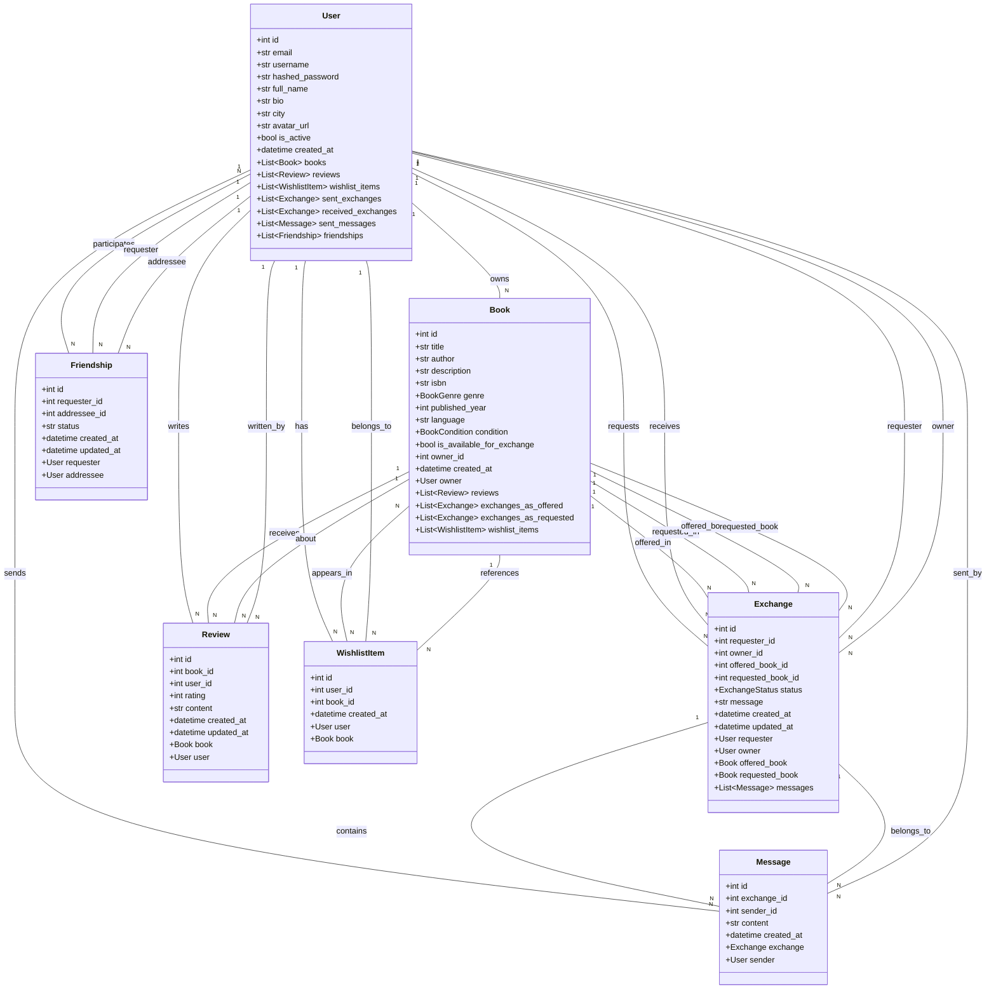
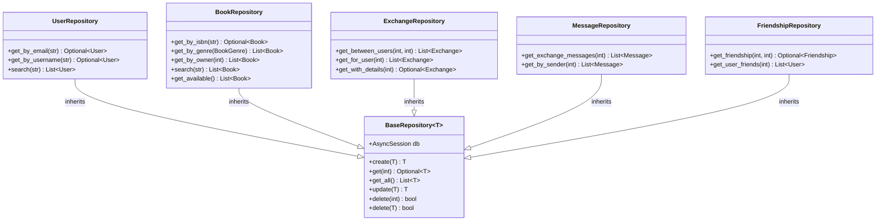
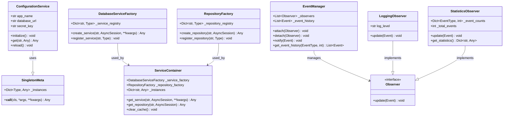
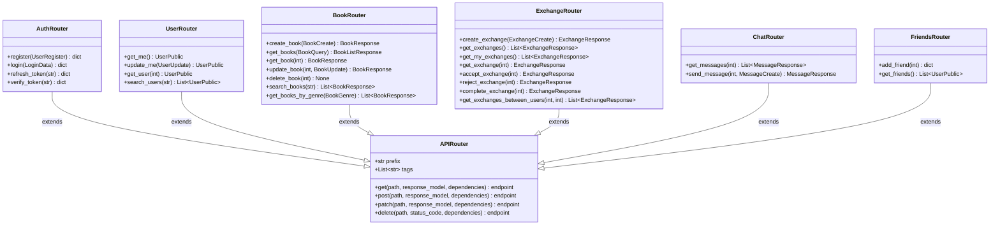
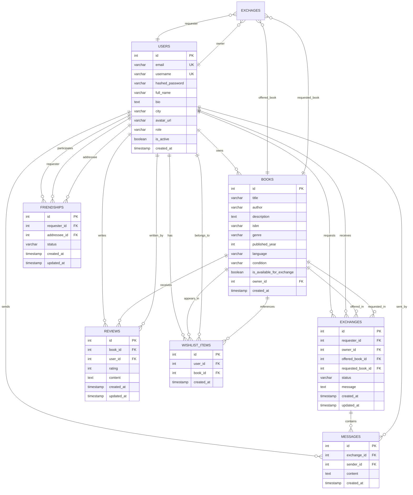

# BookSwap Class Diagram

## Core Domain Models

## Service Layer Architecture

```mermaid
classDiagram
    class AuthService {
        +AsyncSession db
        +UserRepository user_repo
        +register(UserRegister) dict
        +login(str, str) dict
        +refresh_token(str) dict
        +verify_token(str) dict
    }

    class UserService {
        +AsyncSession db
        +UserRepository user_repo
        +get_user(int) User
        +get_user_by_email(str) User
        +update_user(int, UserUpdate) User
        +delete_user(int) bool
        +search_users(str) List~User~
    }

    class BookService {
        +AsyncSession db
        +BookRepository book_repo
        +create_book(BookCreate, int) Book
        +get_book(int) Book
        +update_book(int, BookUpdate) Book
        +delete_book(int) bool
        +search_books(str) List~Book~
        +get_books_by_genre(BookGenre) List~Book~
    }

    class ExchangeService {
        +AsyncSession db
        +ExchangeRepository exchange_repo
        +BookRepository book_repo
        +create_exchange(ExchangeCreate, int) Exchange
        +update_status(int, ExchangeStatus, int) Exchange
        +get_exchanges_for_user(int) List~Exchange~
        +get_between_users(int, int) List~Exchange~
    }

    class ChatService {
        +AsyncSession db
        +MessageRepository message_repo
        +ExchangeRepository exchange_repo
        +send_message(int, int, MessageCreate) Message
        +get_messages(int, int) List~Message~
    }

    class FriendshipService {
        +AsyncSession db
        +FriendshipRepository friendship_repo
        +add_friend(int, int) dict
        +get_user_friends(int) List~User~
    }

    class RecommendationService {
        +get_recommendations(List~str~, List~str~, int) List~dict~
        +_get_fallback_recommendations(List~str~, List~str~, int) List~dict~
    }

    %% Service Dependencies
    AuthService --> UserRepository : uses
    UserService --> UserRepository : uses
    BookService --> BookRepository : uses
    ExchangeService --> ExchangeRepository : uses
    ExchangeService --> BookRepository : uses
    ChatService --> MessageRepository : uses
    ChatService --> ExchangeRepository : uses
    FriendshipService --> FriendshipRepository : uses
```

## Repository Layer Architecture

## Design Patterns Implementation

## API Layer Structure

## Database Schema Relationships

